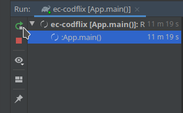
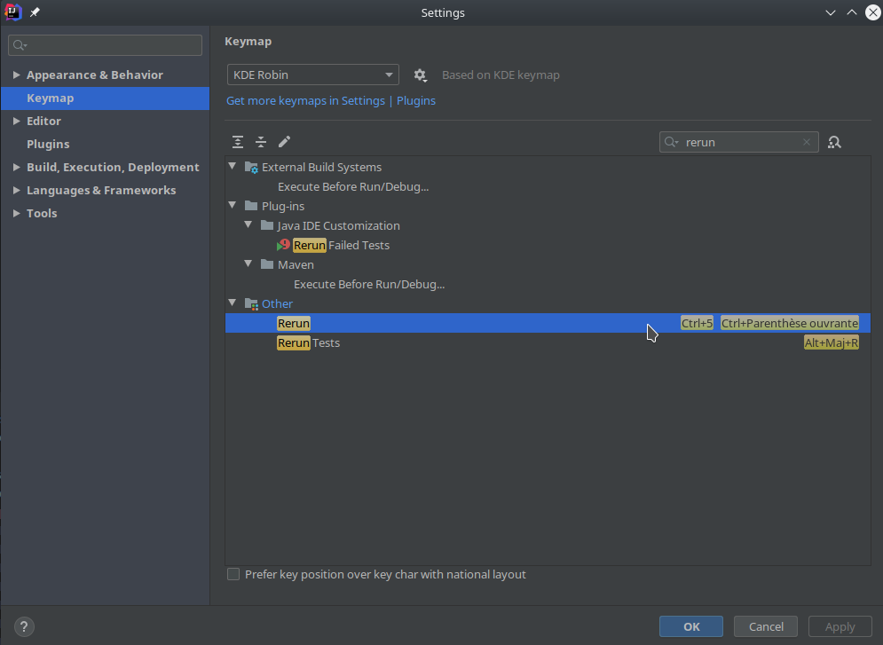

# DisCoding project

## Project structure
The entry point of the project is the `App` class. It will connect to the database and start the server.

* The source code is located in the directory `src/main/java`
* The assets (images, JSS, JS, HTML templates) are located in `src/main/resources`
* The database (MySQL) initialization script is at the root of the project `discoding.sql`

The build system relies on Gradle. If you want to add Java libraries, you can add them in the `build.gradle` file.

## Framework & Libraries
To speed up web development, DisCoding Java uses:
* [The Spark](http://sparkjava.com/) framework to handle the routing, requests and responses handling, etc.
* [Velocity]( http://velocity.apache.org/engine/2.2/user-guide.html ) template engine to render dynamic HTML pages

Take the time to look at their documentation to learn how to develop in the DisCoding project.

## Setup
### Database
You must have a running MySQL service on your development machine. The configuration is located in the `Conf` class:
1. Locate the `Conf` class (`src/main/java/com/codflix/backend/core/Conf`)
1. Update your values for the `DB_*` configuration
1. You just have to update the second parameter of `getEnv()`
```java
public static final String DB_HOST = getEnv("CODFLIX_DB_HOST", "localhost:3306");
public static final String DB_NAME = getEnv("CODFLIX_DB_NAME", "discoding");
public static final String DB_URL = "jdbc:mysql://" + DB_HOST + "/" + DB_NAME + "?serverTimezone=Europe/Paris";
public static final String DB_USER = getEnv("CODFLIX_DB_USER", "root");
public static final String DB_PASSWORD = getEnv("CODFLIX_DB_PASSWORD", "root"); // just update "root" for example
```   

### Run configuration
Once the project has been opened in IntelliJ, a Run Configuration has to be created.
1. Locate the `App` class (`src/main/java/com/codflix/backend/App`)
1. Right click on the file
1. Select **Run...**

### Expected run behavior
When the server is properly running, you should see the following logs:
```
[main] INFO com.codflix.backend.core.Database - The driver name is MySQL Connector/J
[main] INFO com.codflix.backend.core.Database - Connection to database up and running!
... some more logs
[Thread-0] INFO org.eclipse.jetty.server.AbstractConnector - Started ServerConnector@19afa3c5{HTTP/1.1,[http/1.1]}{0.0.0.0:8080}
[Thread-0] INFO org.eclipse.jetty.server.Server - Started @633ms
```

You can now access the running site at http://localhost:8080/.

### Dev workflow
Because Java is a compiled language, each code modification forces a server restart. You can restart the server in the **Run** bottom panel:



**Note: you don't have to restart the server when you change an HTML template or a JS/CSS file.**

To win some time, there is a keyboard shortcut to execute the Rerun action (default is `Ctrl + 5`). IntelliJ has some issues with french keyboards. You can remap this **Rerun** action in the **Settings**:


